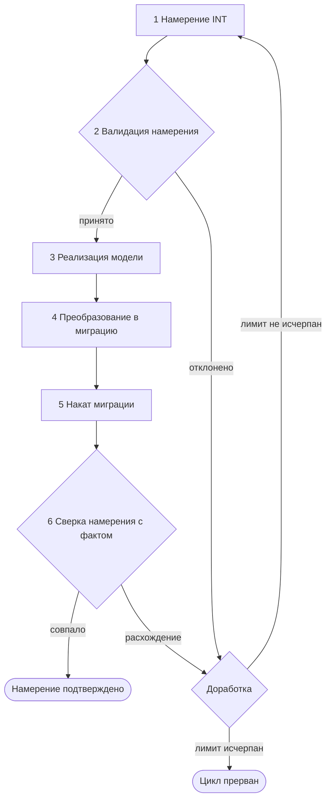
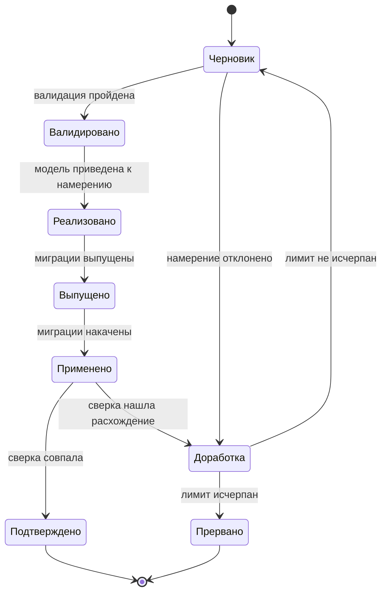

# Замкнутый цикл намерения

Как заявка на построение или изменение модели проходит путь до фактического состояния хранилища
и как результат сверяется с тем, что было заявлено.

---

## Навигация

- [Понятие намерения](#понятие-намерения)
- [Типы намерения](#типы-намерения)
- [Схема цикла](#схема-цикла)
- [Состояния намерения](#состояния-намерения)
- [Стадии 1–2: намерение и валидация](#стадии-12-намерение-и-валидация)
- [Стадия 3: реализация модели](#стадия-3-реализация-модели)
- [Стадии 4–5: выпуск и накат](#стадии-45-выпуск-и-накат)
- [Стадия 6: сверка с фактом](#стадия-6-сверка-с-фактом)
- [Замыкание и лимит](#замыкание-и-лимит)
- [Ограничения и допущения](#ограничения-и-допущения)
- [Версионирование](#версионирование)

---

## Понятие намерения

Намерение (Intent, INT) — заявка на построение или изменение модели: что должно измениться
и зачем. INT формулируется до правки модели и живёт отдельно от неё.

INT — не дельта. Дельта вычисляется из уже изменённой модели и отвечает на вопрос «что изменилось».
INT отвечает на вопрос «что должно было измениться» и потому остаётся эталоном, с которым
сверяется результат. Сверка этих двух величин и замыкает цикл.

INT не является источником истины о структуре графа: единственный источник — модель,
см. [Формат модели](./model-format.md). Производные артефакты — схема хранилища, контракт,
документация — выводятся из модели, а не из INT.

Экземпляр INT адресуется кодом `INT-NNN`, где `NNN` — порядковый номер с ведущими нулями.

---

## Типы намерения

| Тип | Содержание | Исходное состояние модели | Что проверяет валидация |
|-----|------------|---------------------------|-------------------------|
| Новая модель | Заведение одной или нескольких моделей: типы узлов, поля, сигнатуры связей с нуля | Элементов INT в модели нет | Коды и номера заявленных элементов свободны |
| Изменение модели | Добавление или удаление элементов существующей модели | Затрагиваемые элементы в модели есть | Затрагиваемые элементы существуют, а номера добавляемых свободны |

Переименование элемента и смена его атрибутов отдельным типом не выделяются: это частный случай
изменения модели. Класс такой операции — безопасная, ломающая контракт или разрушающая данные —
задан [правилами эволюции контракта](./model-evolution.md#классы-операций).

---

## Схема цикла

Цикл замкнут двумя обратными переходами, и оба ведут в доработку: валидация отклоняет INT
до правки модели, сверка — после наката миграций.

---

## Состояния намерения

- **Черновик** — INT сформулирован, но ещё не проверен.
- **Валидировано** — INT признан выразимым и непротиворечивым; модель не тронута.
- **Реализовано** — модель приведена к INT, дельта вычислима.
- **Выпущено** — по дельте выпущены миграции и дескриптор версии.
- **Применено** — миграции накачены, отпечаток версии в хранилище обновлён.
- **Подтверждено** — сверка нашла в хранилище всё, что заявлено в INT; цикл завершён.
- **Доработка** — точка решения после отрицательного вердикта: следующая итерация или прерывание.
- **Прервано** — лимит итераций исчерпан, последний вердикт зафиксирован, решение за человеком.

Состояние — свойство INT, а не модели: одна версия модели может отвечать подтверждённому INT
и одновременно быть предметом следующего, ещё черновикового.

---

## Стадии 1–2: намерение и валидация

Стадия 1 — человек формулирует INT: тип, затрагиваемые элементы модели, цель изменения.

Стадия 2 — валидация INT до правки модели. Она отвечает на три вопроса:

1. **Выразимость** — описывается ли заявленное средствами метамодели: типами узлов, полями,
   сигнатурами связей по [формату модели](./model-format.md).
2. **Непротиворечивость** — не конфликтуют ли позиции INT между собой: например, поле
   одновременно добавляется и удаляется.
3. **Свобода координат** — не заняты ли заявленные номера полей и коды сущностей,
   см. [занятые номера](./model-format.md#занятые-номера).

Валидация называет ожидаемый класс операций по
[правилам эволюции](./model-evolution.md#классы-операций), но собственной классификации не вводит
и решения о выпуске не принимает: предупреждение о ломающем или разрушающем изменении адресовано
человеку, а остановку вызывают только ошибки процесса,
см. [что останавливает выпуск](./model-evolution.md#что-останавливает-выпуск).

Валидация выполняется до правки модели намеренно: отклонённый INT не должен оставлять
за собой изменённые файлы модели, которые придётся откатывать.

---

## Стадия 3: реализация модели

Роли разделены:

- **Человек** формулирует INT и остаётся владельцем решения — принять результат или продолжить.
- **Агент** прогоняет стадии 3–6 и доводит результат до совпадения с INT.

Реализация — перевод INT в файлы модели. То, что машинно не выразимо, доводится вручную:
вердикт сверки не различает, чем именно модель приведена к INT.

После стадии 3 дальнейшие стадии работают с моделью, а INT остаётся только эталоном сверки.
Источником истины по-прежнему является модель, а не INT.

---

## Стадии 4–5: выпуск и накат

Цикл ничего не меняет в выпуске и накате — он переиспользует действующий порядок,
описанный в [работе с миграциями](./migrations.md#команды).

| Стадия | Команда | Что даёт циклу |
|--------|---------|----------------|
| 4. Преобразование в миграцию | `make model-diff`, `make model-gen` | дельта модели и выпущенные по ней миграции |
| 5. Накат миграции | `make db-apply` | изменённая схема и обновлённый отпечаток версии |
| 5. Проверка сборки с нуля | `make db-verify` | подтверждение, что история миграций собирает схему |

Отпечаток версии и хеша модели пишет [замыкающая миграция](./migrations.md#замыкающая-миграция);
иных способов его изменить не предусмотрено, поэтому он и служит признаком того, какая версия
модели фактически лежит в хранилище.

---

## Стадия 6: сверка с фактом

Сверка двухслойная.

**Нижний слой — схема и модель.** Действующая сверка `make model-verify DSN=...` сравнивает
фактическую схему хранилища с дескриптором и называет расхождения поимённо. Она отвечает
на вопрос «схема соответствует модели?».

**Верхний слой — намерение и факт.** Для каждой позиции INT выносится вердикт:

| Вердикт | Что означает |
|---------|--------------|
| Исполнено | заявленное найдено в фактическом состоянии хранилища |
| Не исполнено | заявленного в хранилище нет |
| Исполнено иначе | заявленное найдено, но в другом виде: иной тип, обязательность, кардинальность |

Слои не сливаются, потому что причины отрицательного вердикта разные:

- расхождение схемы с моделью означает, что **накат не доведён** — миграции выпущены,
  но не применены, либо схема правилась в обход миграций;
- неисполненная позиция INT означает, что **модель приведена не к тому**, что заявлено, —
  накат при этом может быть полностью исправен.

Доработка в этих случаях разная: в первом повторяется накат, во втором правится модель.

---

## Замыкание и лимит

Отрицательный вердикт не завершает цикл. Доработка — точка решения, а не стадия работы:
она сравнивает число выполненных прогонов с лимитом.

- **Лимит не исчерпан** — открывается следующая итерация: INT уточняется и проходит цикл заново.
- **Лимит исчерпан** — цикл прерывается. Последний вердикт сверки фиксируется, INT переходит
  в состояние «Прервано» и **не** помечается исполненным; продолжение — решение человека.

Лимит задаётся снаружи цикла как параметр запуска. Без лимита цикл на систематически невыразимом
INT крутится бесконечно, а прогоны молча накапливаются.

---

## Ограничения и допущения

> **Внимание:** документ описывает концепцию цикла. Реализация вводится отдельным изменением,
> и до неё часть стадий командами не покрыта.

Что не покрыто командами сегодня:

- стадия 1 — INT нигде не фиксируется как артефакт;
- стадия 2 — валидация INT выполняется человеком при чтении заявки;
- верхний слой стадии 6 — сверка «намерение ↔ факт» выполняется вручную; машинно работает
  только нижний слой, `make model-verify`.

Что сознательно оставлено открытым:

- **форма записи INT** — файл в репозитории рядом с моделью, запись в реестре выпусков
  или запись трекера; на состав стадий и вердиктов выбор не влияет;
- **значение лимита итераций по умолчанию** — задаётся при реализации;
- **хранение истории подтверждённых INT** после архивации версии модели.

Принятое допущение: пока форма записи INT не машиночитаема, верхний слой сверки остаётся ручным,
а вердикт по позиции INT выносит человек или агент, читающий заявку и вывод `make model-verify`.

---

## Версионирование

| Версия | Дата | Задача | Агент | Модель | Описание изменений |
|--------|------|--------|-------|--------|--------------------|
| 1.0.0 | 2026-09-18 | OpenSpec change `design-model-intent-loop` | Claude Code | Claude Opus 5 | Начальное создание: понятие намерения и его отличие от дельты, два типа намерения, схема цикла и диаграмма состояний, стадии 1–6, двухслойная сверка, замыкание с лимитом итераций, ограничения концепции без реализации |
