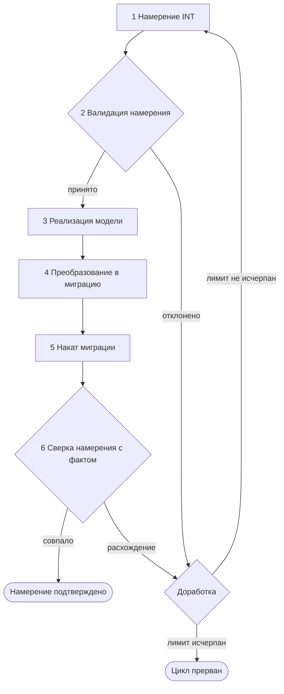
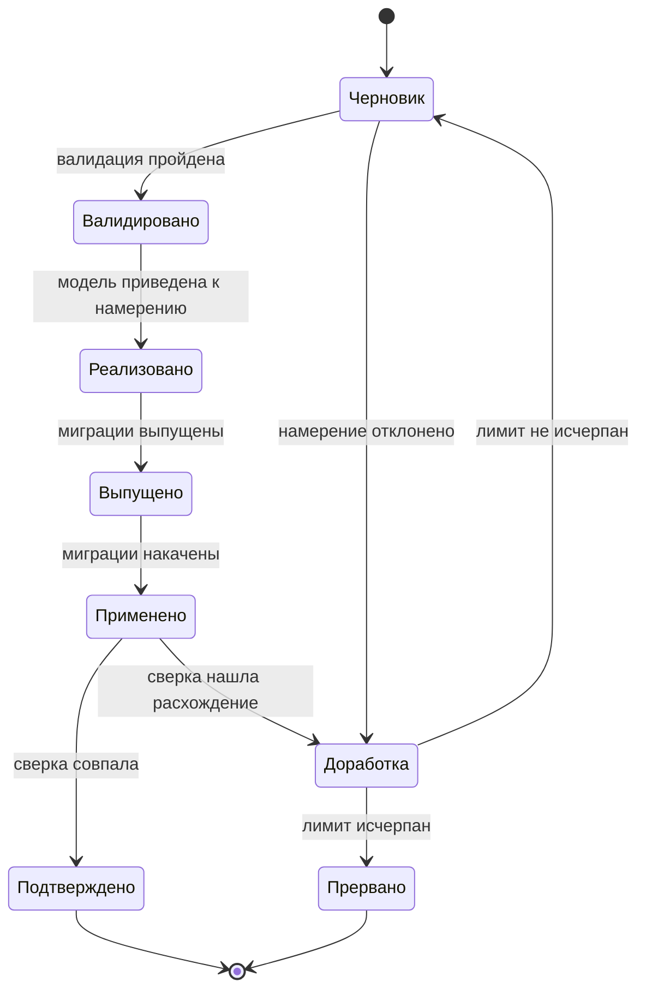

## Context

Мотивация — см. [proposal.md](./proposal.md), раздел «Why».

Действующее состояние, которое ограничивает решение:

- Цепочка от модели до хранилища собрана и специфицирована: `model-build` собирает дескриптор,
  `model-diff` считает дельту, `model-gen` выпускает миграции, `db-apply` накатывает их,
  `model-verify` сверяет фактическую схему с моделью. Изобретать эти шаги заново не требуется.
- Дельта уже классифицируется на безопасные, ломающие и разрушающие операции, а выпуск
  останавливается на ошибках процесса — капабилити `model-compatibility`.
- Модель объявлена единственным источником истины — капабилити `model-contract`. Любое понятие,
  вводимое циклом, не должно претендовать на эту роль.
- Хранилище несёт отпечаток версии и хеша модели, обновляемый только замыкающей миграцией —
  капабилити `migration-generation`. Это единственный доверенный признак того, какая версия модели
  фактически лежит в хранилище.

Ограничение объёма: итерация проектная. Ни код, ни команды, ни формат файлов в ней не вводятся,
поэтому решения ниже фиксируют понятия, границы стадий и вердикты, а не сигнатуры и структуры данных.

## Goals / Non-Goals

**Goals:**

- Ввести намерение (Intent, INT) как сущность, с которой цикл начинается и которой замыкается.
- Описать шесть стадий цикла и переходы между ними, включая обратные.
- Задать типологию намерения и вердикты, на которых цикл переходит к следующей стадии,
  возвращается к доработке или прерывается.
- Отделить то, что цикл переиспользует из действующих механизмов, от того, что в нём нового.
- Выпустить схему цикла, читаемую без чтения кода.

**Non-Goals:**

- Формат файла намерения — поля, схема, расположение в репозитории.
- Команды CLI и цели `Makefile`, реализующие стадии.
- Алгоритм трансляции намерения в файлы модели.
- Машинный формат вердикта сверки и его код возврата.
- Изменение действующих требований капабилити `model-contract`, `model-compatibility`
  и `migration-generation`.

## Decisions

### Решение 1: намерение — отдельная сущность, а не свойство дельты

Намерение фиксируется до правки модели и живёт отдельно от неё. Альтернатива — считать намерением
результат `model-diff`, то есть заявленную дельту, — отвергнута: дельта вычисляется из уже изменённой
модели и потому не может ответить на вопрос «сделано ли то, что хотели». Дельта показывает, что
изменилось; намерение — что должно было измениться. Сверка этих двух величин и есть замыкание цикла.

По [TERM-008](../../../rules/terminology.md#коды-сущностей) экземпляр адресуется кодом `INT-NNN`.

### Решение 2: два типа намерения

| Тип | Содержание | Исходное состояние модели |
|-----|------------|---------------------------|
| Новая модель | Заведение одной или нескольких моделей: типы узлов, поля, сигнатуры связей с нуля | Элементов намерения в модели нет |
| Изменение модели | Добавление или удаление элементов существующей модели | Затрагиваемые элементы в модели есть |

Типология задаёт не форму записи, а ожидание валидации: для новой модели проверяется, что кодов
и номеров ещё нет, для изменения — что затрагиваемые элементы существуют. Третий тип —
переименование и смена атрибутов — отдельным типом не вводится: это частный случай изменения,
а его классификация уже задана капабилити `model-compatibility`.

### Решение 3: схема цикла

Цикл замкнут двумя обратными переходами, и оба ведут в доработку: валидация отклоняет намерение
до правки модели, сверка — после наката. Доработка — не стадия работы, а точка решения: она
сравнивает число выполненных прогонов с лимитом и либо открывает следующую итерацию с уточнённым
намерением, либо прерывает цикл.

### Решение 4: состояния намерения

Состояние — свойство намерения, а не модели: одна и та же версия модели может отвечать
подтверждённому намерению и одновременно быть предметом следующего, ещё черновикового.
Прерванное намерение остаётся в истории вместе с последним вердиктом сверки: цикл прерывается,
но результат прогонов не стирается.

### Решение 5: валидация намерения выполняется до правки модели

Стадия 2 отвечает на три вопроса: выразимо ли намерение в метамодели, непротиворечиво ли оно внутри
себя, не конфликтует ли с занятыми номерами и кодами. Класс операций — безопасная, ломающая
контракт, разрушающая данные — валидация называет по действующей классификации `model-compatibility`,
а не вводит собственную; она предъявляет класс человеку заранее, но решения о выпуске не принимает.

Альтернатива — валидировать намерение после правки модели, вместе с дельтой, — отвергнута: тогда
отклонённое намерение оставляет за собой уже изменённые файлы модели, которые придётся откатывать.

### Решение 6: реализацию ведёт агент, ручная доводка допускается

Человек формулирует намерение и остаётся владельцем решения; агент прогоняет стадии 3–6 и доводит
результат до совпадения. То, что машинно не выразимо, доводится вручную и проверяется тем же
циклом — вердикт сверки не различает, чем именно приведена модель к намерению.

Ответственность за содержание модели остаётся на модели: намерение не является источником истины
и не подменяет её по `model-contract`. Стадия 3 — перевод намерения в файлы модели, после которого
дальнейшие стадии работают с моделью, а намерение служит только эталоном сверки.

### Решение 7: стадии 4 и 5 переиспользуют действующие механизмы

| Стадия | Механизм | Новое в цикле |
|--------|----------|---------------|
| 3. Реализация модели | правка файлов модели | привязка правки к намерению |
| 4. Преобразование в миграцию | `model-gen` из дельты | ничего |
| 5. Накат миграции | `db-apply`, замыкающая миграция с отпечатком | ничего |
| 6. Сверка | `model-verify` (схема ↔ модель) | слой «намерение ↔ факт» поверх |

Цикл ничего не меняет в выпуске и накате: он добавляет к ним начало (намерение и его валидация)
и конец (сверка с намерением).

### Решение 8: сверка двухслойная

Нижний слой — действующая сверка схемы хранилища с моделью по `migration-generation`: она отвечает
на вопрос «схема соответствует модели?». Верхний слой — сверка намерения с фактом: для каждой
операции намерения выносится вердикт «исполнено», «не исполнено» или «исполнено иначе».

Слои не сливаются: расхождение схемы с моделью означает, что накат не доведён, а неисполненная
операция намерения — что модель приведена не к тому, чего просили. Это разные причины отрицательного
вердикта, и доработка в этих случаях разная.

### Решение 9: лимит итераций задаётся снаружи цикла

Число прогонов ограничено лимитом; его значение — параметр запуска, а не константа концепции.
При исчерпании лимита цикл прерывается с фиксацией последнего вердикта: продолжение — решение
человека. Без лимита цикл на систематически невыразимом намерении крутится бесконечно.

### Решение 10: концепция живёт в `docs/`, а не только в этом изменении

Документ `docs/model-intent-loop.md` встаёт рядом с `docs/model-format.md`,
`docs/model-evolution.md` и `docs/migrations.md` и становится источником определения понятия
«намерение» по [TERM-001](../../../rules/terminology.md#единый-источник-определения). Артефакты
изменения после архивации перестают быть действующим документом, а концепция нужна постоянно.

## Risks / Trade-offs

- **Концепция без реализации расходится с кодом** → документ описывает стадии через действующие
  команды и отмечает, что стадии 1, 2 и верхний слой сверки командами пока не покрыты;
  реализация предлагается отдельным изменением и правит документ вместе с кодом.
- **Намерение воспринимается как второй источник истины, конкурирующий с моделью** → в концепции
  зафиксировано: намерение — эталон сверки и вход цикла, производные артефакты выводятся только
  из модели по `model-contract`.
- **Лимит итераций маскирует системную ошибку: намерение невыразимо, а цикл гоняет прогоны**
  → прерывание фиксирует последний вердикт и передаёт решение человеку, а не помечает намерение
  исполненным.
- **Сверка «намерение ↔ факт» без машиночитаемой формы намерения остаётся ручной** → в этой
  итерации это принятое ограничение: концепция задаёт вердикты, форму записи задаёт реализация.
- **Два диалекта описания изменения — намерение и дельта — расходятся** → типы и операции намерения
  описываются в терминах элементов модели, теми же понятиями, что и дельта.

## Open Questions

- Где физически живёт намерение: файл в репозитории рядом с моделью, запись в реестре выпусков
  или запись трекера. Вопрос формы записи, не влияющий на состав стадий и вердиктов.
- Значение лимита итераций по умолчанию.
- Нужно ли хранить историю подтверждённых намерений после архивации версии модели.

## Версионирование

| Версия | Дата | Задача | Агент | Модель | Описание изменений |
|--------|------|--------|-------|--------|--------------------|
| 1.0.0 | 2026-09-18 | OpenSpec change `design-model-intent-loop` | Claude Code | Claude Opus 5 | Начальное создание: понятие намерения, два типа, схема цикла и состояний, двухслойная сверка, лимит итераций и границы концепции без реализации |
